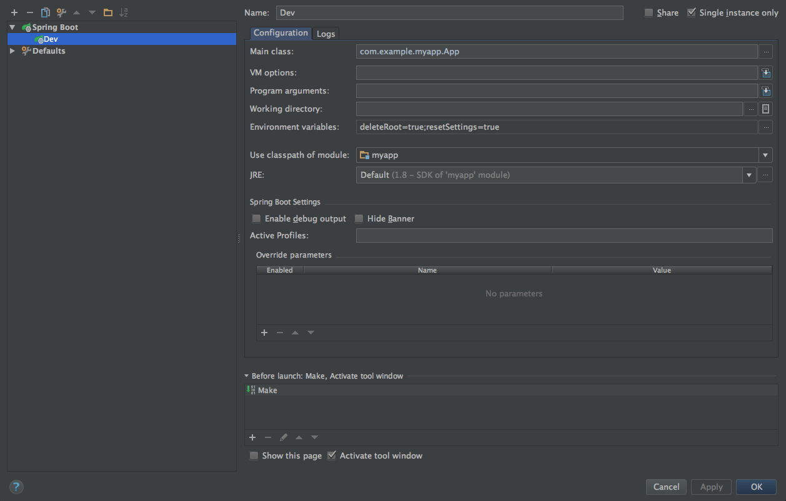

[](https://www.youtube.com/watch?v=qRC4Vk6kisY) [](https://david-dm.org/lfuelling/generator-springboot-kickstart) [](https://img.shields.io/) [](https://img.shields.io/)

# SpringBoot Kickstart

is a Yeoman generator that creates a basic SpringBoot application with basic authentication, Thymeleaf, `javax.mail` and MongoDB. Bootstrap 4 (alpha 4) is used on the frontend side. 
Since v1.0.1 you can choose between Bootstrap 4 and 3.3.6 but **keep in mind** that the frontend HTML is still for Bootstrap 4 and may look shitty.

It has absolutely nothing to do with [Kickstart](http://getkickstart.com/) but was inspired by [Bootstrap Kickstart](https://github.com/micromata/bootstrap-kickstart).

## Table of Contents

- [Quick install guide](#quick-install-guide)
- [Running the app](#running)
- [Docker Integration](#docker)

## Quick install guide

You need to have [Node.js](https://nodejs.org) installed.

	$ npm install -g yo
	$ npm install -g generator-springboot-kickstart
	$ yo springboot-kickstart

## Running

1. Create directories for mongodb: `$ mkdir data && mkdir data/db && mkdir log`
2. Create keystore: `$ ./generateKeygen.sh` (chmod it, if it's not executable)
3. Update settings in `/src/main/resources/application.properties` **especially the keystore related**
4. Start MongoDB: `$ mongod --config mongodb.conf`
5. Start the webapp (instructions for IntelliJ below, for cmdline use google)

I recommend setting the following environment variables when developing:

```
deleteRoot=true
resetSettings=true
```

When using those, you'll have a clean setup after every build and a new root user is created every launch.

### Using IntelliJ IDEA

The generated app can run without problems using the following run configuration:



## Docker

Since 1.3.0 there will be two new files created: `docker-compose.yml` and `docker/Dockerfile`. Those contain everything you need to run the webapp inside Docker.

Since 1.3.1 Docker is optional.

Since 1.3.2 there is a script to start the docker stuff.

**Please note** that you need the latest version of Docker compose for this, because I'm using the new config file format.

**Please note** that this will not run in Mac OS X or Windows, [because MongoDB can't handle vboxfs](https://github.com/docker-library/mongo/issues/30).

To run your app as a Docker container you need to follow this steps:

1. [Start the webapp](#running) at least once to make sure there are no errors
2. **(you can skip this, if you used the keygen script)** Edit line 20 of the Dockerfile and replace the `../development.pkcs12` with the name of the keystore you are using
3. In the root directory of your project run `docker-compose build` in a terminal and let it build the needed images
4. Still in the root directory run `docker-compose up`
5. Go to `http://[your-docker-host]:8080`
